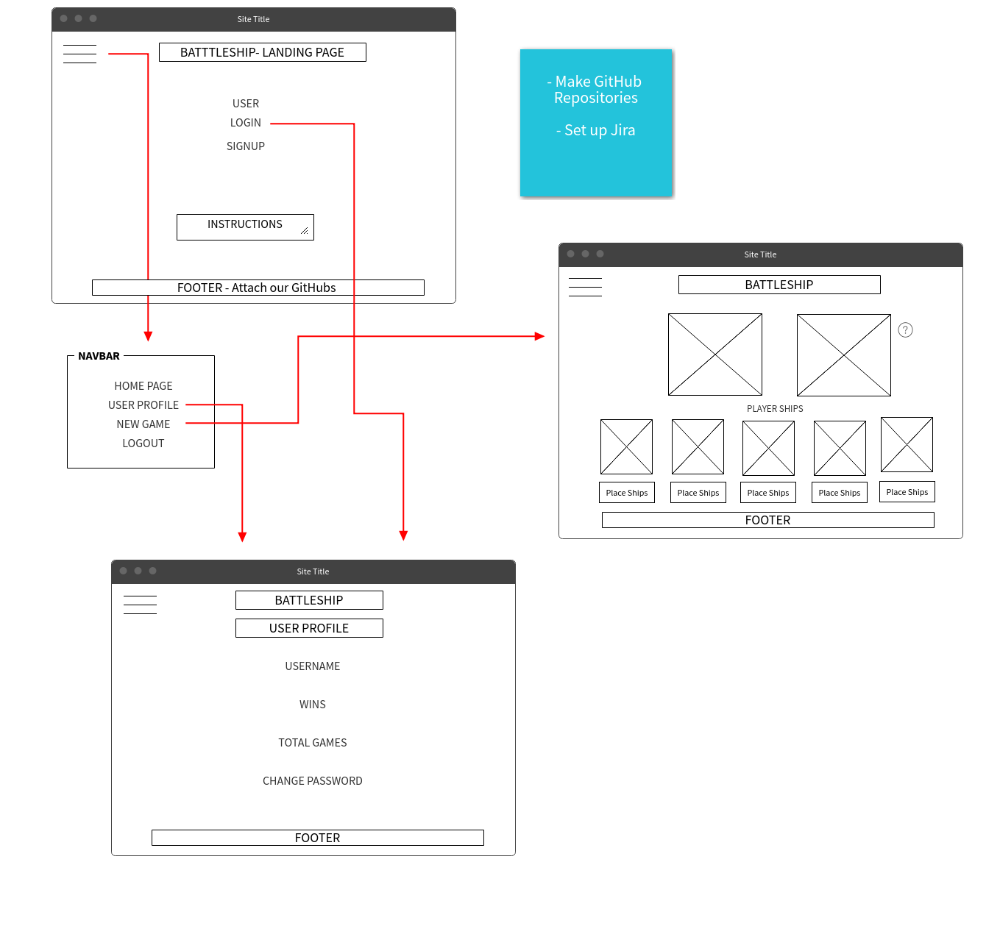
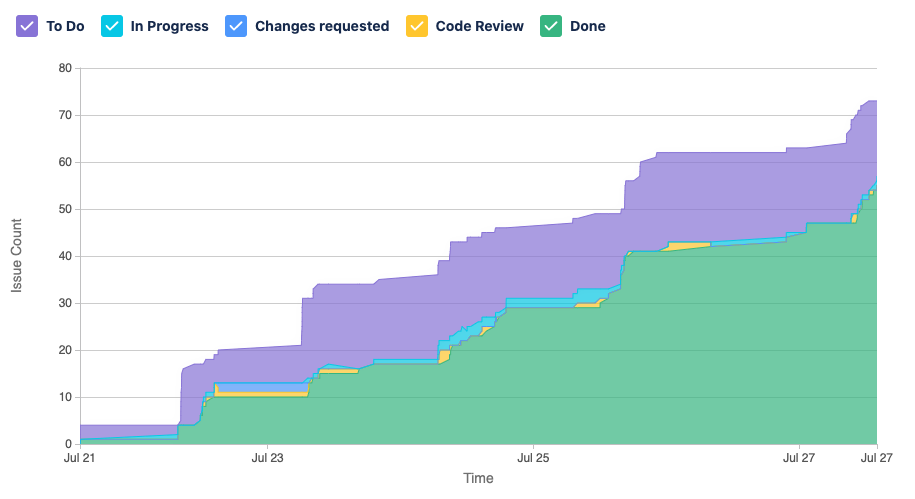

# Battleship

**Battleship** is a clone of the strategy game [Battleship](<https://en.wikipedia.org/wiki/Battleship_(game)>).

## Links

- [Live site on Heroku](https://playbattleship.herokuapp.com/)
- [Back end GitHub repository](https://github.com/caldric/battleship-api/)

## Technologies

- MERN stack (Mongo, Express, React, Node)
- HTML
- CSS
- Bootstrap
- JavaScript

## Features

- Event listeners and handlers
- Document Object Model (DOM) manipulation
- Asynchronous JavaScript with async and await
- User information storage and password encryption using Bcrypt
- User sign up and log in functionality
- Full CRUD functionality
- RESTful API

## Wireframe

## User Stories

- As a developer, I'd like to have the concurrently package installed so that I don't need to run the API server and the client build separately.
- As a user, I want to be able to log in.
- As a user, I'd like the sign up and login buttons disabled when I'm logged in.
- As a user, I want to be able to create a game.
- As a developer, I'd like games to be deleted upon completion or when leaving game so that the database does not store unneeded data.
- As a user, I want to be able to put my pieces on the board.
- As a user, I want to be able to make "shots" against my opponent.
- As a user, I'd like to get some feedback on UI elements that I can interact with.
- As a user, I'd like to be able to login automatically after I sign up.
- As a user, I'd like to know when I have sunk a ship.
- As a user, I'd like to have the enemy computer pick a random coordinate to attack.
- As a user, I want to track my lifetime stats: total games, wins, and losses.
- As a user, I want to send a link to play with a specific person.
- As a user, I want to queue a game with other random players.

## Approach

Our team adopted the Agile Scrum methodology. As we only had a week to complete the project, we wanted a workflow that was both incremental and iterative. From Scrum, we integrated sprint planning, sprints, daily scrums/stand-ups, sprint reviews, and sprint retrospectives into our workflow.

In our kanban board, we had the "TO DO", "IN PROGRESS", "CHANGES REQUESTED", "CODE REVIEW", and "DONE" cards. Once the sprint starts, the backlog issues assigned to the particular sprint goes to TO-DO. The developer then self-assigns one of the issues, makes a feature branch in Git, and the issue moves to IN PROGRESS. After the particular issue is resolved, the developer submits a pull request (PR) to the repository, and the issue moves to CODE REVIEW where another developer does a functional test and a code review. If there are any changes that need to be made on the PR, the reviewer annotates the specific lines of code that need to be resolved, and the issue moves back to CHANGES REQUESTED. Otherwise, the reviewer approves the PR, merges the feature branch onto the master branch, and the issue is moved onto DONE.

### Tools

- Project management: Jira
- Version control: Git, GitHub
- Communication: Slack, Zoom, Google Hangouts
- Code editor: Visual Studio Code
- Formatter: Prettier
- Linter: ESLint

### Cumulative Flow Chart

## Known Issues

- Profile does not keep track of user statistics
- No indication when a enemy ship is sunk, only when you hit/miss
- Randomly generated enemy ships can potentially overlap
- Your ships can be placed more than once
- Your ships can overlap
- Ships don't display when placed, only representational X's
- When placing ships, if you rotate it you must click place again for the direction to actually change when placed
- Game does not end unless you click end game
- Games can be accessed publicly if you have the URL
- You can only play against the computer, not friends (if you have ones to play with)
- If you accidentally leave the game page you can't return to it unless you have the URL
- Username has to be unique so you can't create an account if your desired name already exists
- If sign up/login doesn't work there is no error message

##### Authors/Developers:

[Claude Aldric](https://github.com/caldric),
[Senthil Kannan](https://github.com/spk2dc),
[Likitha Duggirala](https://github.com/likithaaa)

##### Last Updated: 7/28/2020
